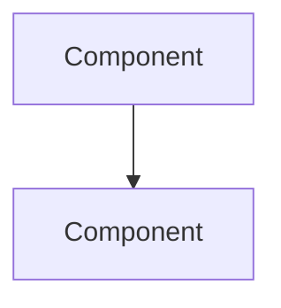

## 🎯 Problem Statement

[What challenge are we solving?]

## 🏗 Proposed Architecture

[Design with Mermaid diagram]

## 🤔 Alternatives Considered

| Option | Pros | Cons |
|--------|------|------|
| [Option 1] | | |
| [Option 2] | | |

## ✅ Decision Rationale

[Why this approach over alternatives?]

## 📋 Implementation Phases

- [ ] Phase 1: [Description]
- [ ] Phase 2: [Description]
- [ ] Phase 3: [Description]
